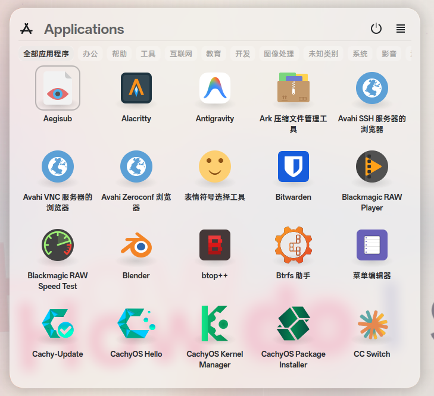
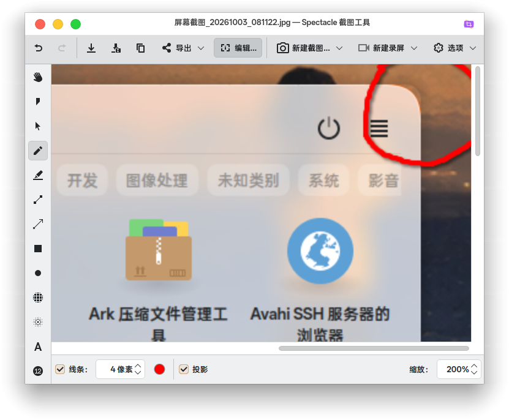

# 修复记录与待验证范围

## 待验证

- [ ] 实际重启后的首次唤起保留完整动画开头
- [ ] 多屏、不同显示缩放和 X11 下的圆角、阴影及背景模糊

未测量 GPU 帧时间。上述范围不代表本次本机验收失败。

## 2026-10-06 已完成

- [x] 修正四个圆角外侧的额外轮廓和边界阴影
- [x] 统一玻璃背景、边框、阴影和模糊遮罩
- [x] 修正 Plasma 显示与尺寸事件清除模糊的问题
- [x] 保留冷启动动画开头，并通过首帧延迟回归测试
- [x] 本机安装与桌面模糊检查通过；用户同意提交和合并

原生背景使用 32 像素圆角，旧窗口阴影仍来自 `Utterly-Round` 主题，主题圆角约为 12 像素。替换背景 SVG 不会替换 Plasma 的主题阴影。未发现残留的可配置圆角强度数据。

修复禁用主题背景和主题阴影。两个动画后端共用 `glass.svg`。原生桥接模块直接把 SVG 遮罩传给 KWindowEffects，并在 Plasma 的 Wayland 显示与尺寸事件结束后恢复模糊。安装脚本移除旧的 `glass-panel.svg`。

动画等待窗口首帧后才开始计时。淡入阶段每步最多推进 33 ms。测试模拟首帧延迟 200 ms、首个回调延迟 2 s 和后续帧延迟 400 ms，检查动画开头仍保留。真实重启验收与模拟测试分别记录。

验证环境：CachyOS、Plasma/KWin 6.7.5、Qt 6.11.2、Wayland、Intel Iris Xe。JS、Qt、原生 Plasma Dialog 和安装测试通过。实际启动器首次打开与连续切换 10 次后均保留模糊。桌面截图测试验证首次显示、再次显示和尺寸变化，条纹亮度标准差为开启模糊时 `0.00`、关闭时 `25.98`。

用户于 2026-10-06 提供当前效果截图，并同意提交和合并。

## 原始问题记录

2026-10-03 的截图显示圆角外侧存在额外边缘。四个圆角都可能异常；红圈标出的右上角只是示例。2026-10-06 的录像后半段还显示连续开合时的阴影闪烁。原始截图在 Spectacle 中以 200% 显示。

核对时，GitHub `master` 与本机安装内容均为 `4a6f548`，当前工作区原本位于较旧的 `513d605`。本次修复基于 `4a6f548`。
