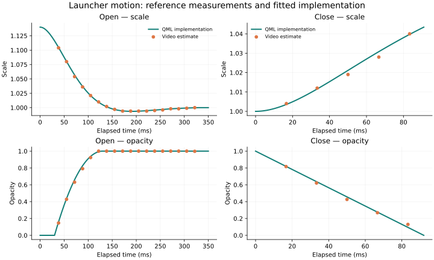

# macOS 录屏动画拟合

分支：`codex/macos27-motion`。基线：fork 的 `origin/main`，提交 `513d605`。

参考文件为用户提供的 `2026-10-02 14-00-11.mov`。视频为 1660 × 1080、60 fps、21 秒。视频没有显示系统版本页，本文不独立确认 macOS 版本。参数来自录屏拟合，不是 Apple 内部参数。

## 观察与测量

打开时，面板从较大尺寸缩到正常尺寸。面板随后略小于正常尺寸，再回稳。关闭时，面板放大并淡出。缩放中心位于面板中心。录屏没有显示现有代码中的朝 Dock 平移，也没有显示图标区单独延迟出现。

主要打开样本是第 536–553 帧（8.933–9.217 秒）。第一次打开时，最近使用的应用还在重排，因此不用早期图标拟合缩放。关闭样本是第 447–451 帧（7.450–7.517 秒）。第二次关闭的第 618–622 帧也显示相同方向和相近时长。

测量时先将画面缩到 830 × 540。打开样本使用第 570 帧作为静止面板，第 510 帧作为桌面背景。取 `x=194…635, y=130…374` 的区域，每 3 像素采样。绕 `(415, 223.5)` 缩放静止面板，在 `0.98…1.18` 范围内按 `0.001` 搜索比例。每个比例用最小二乘估计混合透明度：`当前帧 ≈ 背景 + alpha × (缩放后的面板 − 背景)`。选择残差最小的比例。关闭样本使用第 415 帧面板和第 380 帧背景。

原始结果保存在 [CSV](../tests/fixtures/macos-motion.csv)。时间零点是推定值：打开为 8.895 秒，关闭为第 446 帧。打开早期不可见，初始尺寸与时间零点不能单独准确识别。单帧时间为 16.67 毫秒；视频压缩、背景模糊和应用重排都会影响估计。透明度是图像混合估计，不是系统窗口属性。

## 实现参数

| 项目 | 参数 | 依据 |
|---|---|---|
| 打开缩放 | `1.14 → 1`，角频率 `23 rad/s`，阻尼比 `0.70` | 对采样尺寸拟合；初始不可见比例取整 |
| 轻微回弹 | 最小比例约 `0.994` | 第二次打开的可见样本 |
| 打开透明度 | 延迟 `30 ms`，随后 `100 ms` 的 `1 − (1 − t)²` | 与可见透明度样本对齐 |
| 关闭缩放 | 朝 `1.08` 放大，角频率 `20 rad/s`，临界阻尼 | 拟合可见的前 83 毫秒；不可见终点是实现选择 |
| 关闭透明度 | `92 ms` 线性淡出 | 第一段关闭样本的最小二乘近似 |
| 前景模糊 | 随透明度恢复清晰，最大值 `12` | 视觉近似，未独立恢复原始模糊核 |
| 变换中心 | 面板中心，无额外平移 | 多次开合的几何位置 |

弹簧采用解析解。反向时保留缩放位置和速度。透明度从当前值重新计时，保证数值连续，但不保证透明度变化速度连续。系统动画速度按时间比例调整；Off 模式直接到达终点。长帧按真实经过时间采样，不再把每帧时间截成 33 毫秒。

KWin 接收 QML 的同一组采样。面板经过比例 `1` 时继续回弹，仅在收到 `settled` 后释放变换。内置后端仅在动画期间增加透明边距，容纳放大的表面和阴影。窗口位置补偿这些边距，保持面板位置。动画结束后移除边距，避免扩大静止时的原生模糊遮罩。关闭在透明度归零时隐藏，不等待不可见的缩放尾段。

## 验证与范围

`tests/qt-smoke.py` 用独立录屏样本检查曲线，允许缩放误差 `0.004`、透明度误差 `0.06`。测试还检查反向连续性、60/144 Hz 一致性、长帧、系统速度、Off、延迟隐藏和放大边距。`tests/motion-effect.test.js` 检查 KWin 放大样本、回弹期间的状态保留及结束清理。

本次拟合覆盖启动器的打开和关闭。视频中的 OBS 窗口最小化、Dock 图标放大属于其他组件。搜索和分类切换缺少参考片段，保留原行为。

本次通过 JS 测试、Qt 离屏测试、原生 Plasma Dialog 离屏测试、安装测试和 QML 语法检查。原生测试需要访问会话服务；受限沙箱内会超时。

2026-10-03 已安装到本机并重载 Plasma。圆角过渡范围从 28 像素增至 32 像素，同时调整贝塞尔控制点，让轮廓更圆。原生材质、内置材质、边框、阴影和模糊遮罩使用同一轮廓。原生测试逐帧检查四个圆角在打开和关闭期间不进入模糊区域。

本机慢速抽帧检查显示，打开和关闭的中间帧均保留圆角。检查后恢复正常动画速度。用户录屏中的偶发直角帧暂未复现，因此不将该问题标为已彻底修复。屏幕边缘、多屏、高 DPI 和正常速度下的偶发问题仍需复测。

遮罩处理参考 [KDE Dialog 源码](https://github.com/KDE/libplasma/blob/master/src/plasmaquick/dialog.cpp)。原生模糊区域来自背景遮罩，因此动画边距只在内置动画期间保留。
